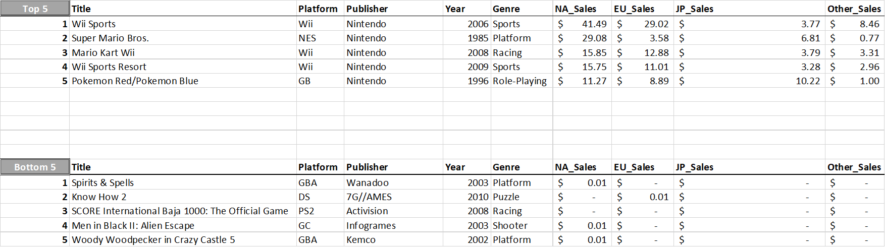
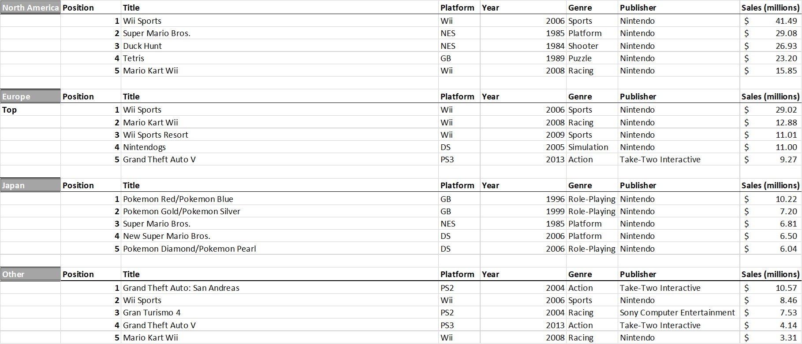
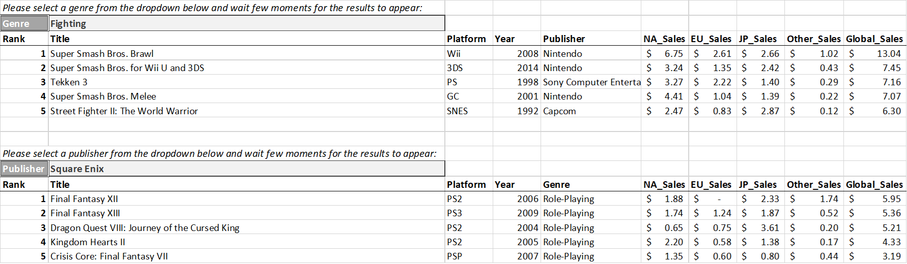
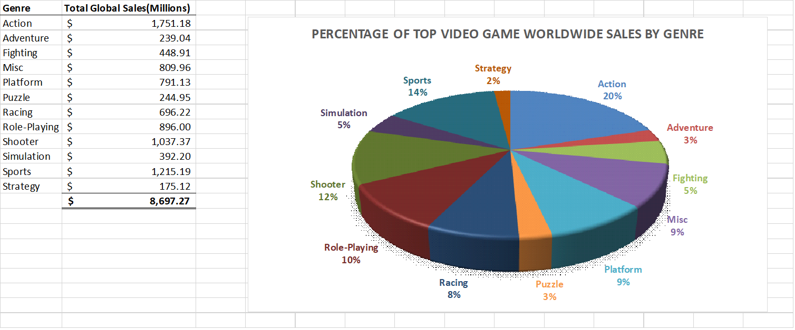
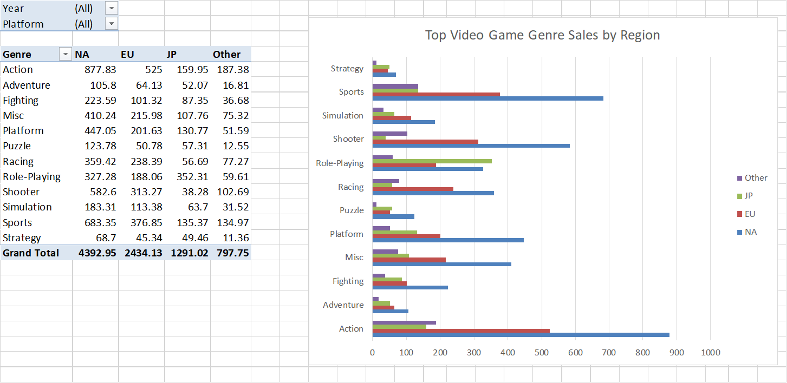
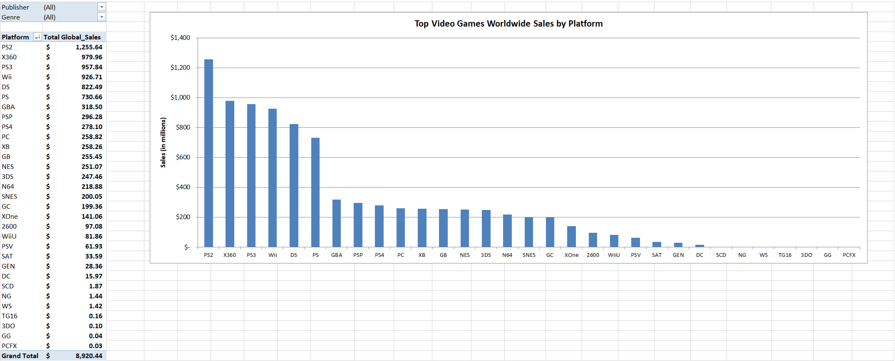
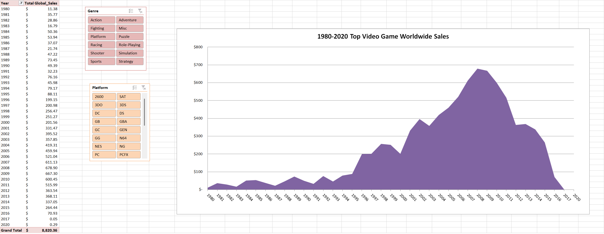

Top Video Game Sales Analysis
================
Leopoldine Mirtil

### Data Source  

The data used in this analysis was originally uploaded by user GregorySmith on Kaggle.com for public use, [link here](https://www.kaggle.com/datasets/gregorut/videogamesales?resource=download). The data 
lists video games with sales greater than 100,000 copies from 1980 to 2020. It also includes the overall 
rank, platform, year, genre, publisher and sales region (North America, Japan, Europe, Others and Global).

## Sheet Summaries

### Top & Bottom 5 

Identified the top and bottom 5 video games and their related infomation using the existing rank column.

Formulas used: 

*Top 5*

    Title:          =VLOOKUP($A2,vgsales!$A$1:$K$16599, 2, FALSE)

    Platform:       =VLOOKUP($A2,vgsales!$A$1:$K$16599, 3, FALSE)

    Publisher:      =VLOOKUP($A2,vgsales!$A$1:$K$16599, 6, FALSE)

    ...

    Global Sales:   =VLOOKUP($A2,vgsales!$A$1:$K$16599, 11, FALSE)

*Bottom 5* 

    Title:          =VLOOKUP(LARGE(vgsales!$A$1:$A$16599,ROWS(vgsales!$A$2:vgsales!$A2)),vgsales!$A$1:$K$16599, 2, FALSE)

    Platform:       =VLOOKUP(LARGE(vgsales!$A$1:$A$16599,ROWS(vgsales!$A$2:vgsales!$A2)),vgsales!$A$1:$K$16599, 3, FALSE)

    ...

    Global Sales:   =VLOOKUP(LARGE(vgsales!$A$1:$A$16599,ROWS(vgsales!$A$2:vgsales!$A2)),vgsales!$A$1:$K$16599, 11, FALSE)

<!-- -->

### Top 5 by Region

Identified the top 5 video games in each region. Utilized the following formulas:

        Title:      {=INDEX(vgsales!B$2:B$16599,MATCH(LARGE(vgsales!$G$2:$G$16599-ROW(vgsales!$G$2:$G$16599)/10^5,1),vgsales!$G$2:$G$16599-ROW(vgsales!$G$2:$G$16599)/10^5,0))}
        Platform:   {=INDEX(vgsales!C$2:C$16599,MATCH(LARGE(vgsales!$G$2:$G$16599-ROW(vgsales!$G$2:$G$16599)/10^5,1),vgsales!$G$2:$G$16599-ROW(vgsales!$G$2:$G$16599)/10^5,0))}
        ...
        Sales:      {=INDEX(vgsales!G$2:G$16599,MATCH(LARGE(vgsales!$G$2:$G$16599-ROW(vgsales!$G$2:$G$16599)/10^5,1),vgsales!$G$2:$G$16599-ROW(vgsales!$G$2:$G$16599)/10^5,0))}

<!-- -->

### Dynamic Top 5-Genre & Platform

Two tables show the top five games by genre and publishers along with the related information. The drop down menus were created using data validation using two reference sheets (Genre List and Publisher List). Below is a snippet of the formulas used in both tables:

    Title:         {=IFERROR(INDEX(vgsales!B$2:B$16599, SMALL(IF(vgsales!E$2:E$16599=$B$2, ROW(vgsales!B$2:B$16599)-1,""),ROW(vgsales!B$2:B$16599)-1)),"")}

    Platform:      {=IFERROR(INDEX(vgsales!C$2:C$16599, SMALL(IF(vgsales!E$2:E$16599=$B$2, ROW(vgsales!C$2:C$16599)-1,""),ROW(vgsales!C$2:C$16599)-1)),"")}

    ...

    Global Sales:  {=IFERROR(INDEX(vgsales!K$2:K$16599, SMALL(IF(vgsales!E$2:E$16599=$B$2, ROW(vgsales!K$2:K$16599)-1,""),ROW(vgsales!K$2:K$16599)-1)),"")}

<!-- -->

### Sales by Genre

A table displaying the total global sales of the top video games and displayed in the pie chart. The values were calculated using the formula below:

    {=SUMIF(vgsales!E2:E16599, A2, vgsales!K2:K16599)}

The total value was calculated using SUM.

<!-- -->

### Sales by Genre and Region

A pivot table showing the genre sales by region, with year and platform filters.This table is visualized 
in a side bar chart. 

<!-- -->

### Platform Sales

A pivot table showing the total global sales by platform and visualized in a column chart.

<!-- -->

### Annual Sales

A pivot table showing the annual world wide sales of the top video games, along with genre and platform filters. The table is visualized in an area chart.

<!-- -->
